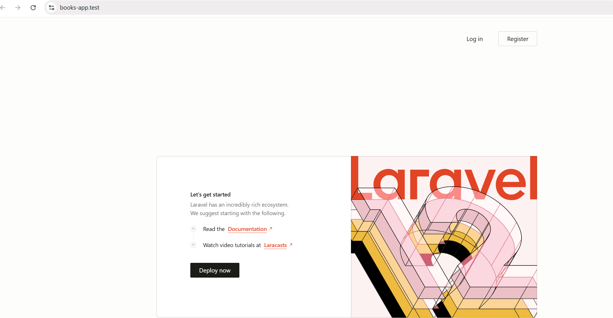

# Books-App

## Installation

Installation mittels

```
laravel new books-app
```

Die weitere Arbeit erfolgt in PHPStorm. Bei der Bearbeitung wird `npm run dev` verwendet. Dadurch werden die Stile (css, js, ...) korrekt angezeigt.

## Konfiguration

Laravel wird in einer Datei namens `.env` konfiguriert. Diese Datei muss besonders geschützt werden, da sie auch Zugangsdaten beinhaltet. Die Speicherung darf nicht in einem Repository erfolgen.

Ein Key (`APP_KEY`) kann mittels `php artisan key:generate` erstellt werden. Standardmäßig wird die `.env`-Datei mittels `gitignore`-Datei ignoriert.

In der `.env`-Datei befindet sich auch der Zugang zur Datenbank. Standardmäßig wird mit `Sqlite` gearbeitet. Wird auf eine andere DB umgestellt, so muss der Konfigurationseintrag `DB_CONNECTION` entsprechend angepasst werden (zB mysql inkl. Benuterdaten). Nach `php artisan migrate` werden alle Tabellen lt. Migration erstellt.

## API-Installation

Um eine API verwenden zu können, muss folgender Befehl ausgeführt werden:

```
php artisan install:api
```

In `routes`-Verzeichnis wird dadurch eine `api.php` erstellt. In dieser Datei werden alle API-Endpunkte erstellt. In der `web.php`-Datei werden alle für die Website relevanten Urls erstellt.

## Backend-Installation

Laravel Breeze ermöglicht die schnelle und einfache Verwendung eines Backends:

```
composer require laravel/breeze --dev
php artisan breeze:install
```

> **Hinweis:** Nach der Installation ev. erneut `npm run dev` ausführen.

Nach dieser Installation ist Laravel inkl. `Login` etc. verfügbar:



## Welcome anpassen

Die Welcome-Datei wird angepasst, um dem Projekt zu entsprechen. Hierzu wird die bestehende Datei folgendermaßen lt. Tailwind-Dokumentation (https://tailwindcss.com/docs/installation/framework-guides/laravel/vite) verändert:

```html
<!doctype html>
<html>
  <head>
    <meta charset="utf-8" />
    <meta name="viewport" content="width=device-width, initial-scale=1.0" />
    @vite('resources/css/app.css')
  </head>
  <body>
    <h1 class="text-3xl font-bold underline">
      Hello world!
    </h1>
  </body>
</html>
```

Die Welcome-Seite wird ausgegeben, da in der `web.php`-Datei folgedne Route vorhanden ist:

```php
Route::get('/', function () {
    return view('welcome');
});
```

Beim Aufruf der Domain (bzw. `/`) wird die View `welcome.blade.php` in `ressources/views` verwendet. Um alle Routes anzuzeigen wird folgender Befehl verwendet:

```
php artisan route:list
```

In dieser Liste ist ersichtlich, dass eine Route `/login` mit dem Namen `login` verfügbar ist.

In Blade kann mittels `@if` eine Abfrage durchgeführt werden.

```bladehtml
@if (Route::has('login'))
            @auth
                <li><a href="{{ url('/dashboard') }}">Dashboard</a></li>
            @else
                <li><a href="{{ url('/login') }}">Anmeldung</a></li>
            @endauth
        @endif
```

Im obigen Beispiel wird überprüft, ob die Route `login` verfügbar ist (also ob ein Auth-System installiert wurde). Anschließend wird der Anmeldestatus des Benutzers mittels `@auth` abgefragt.

> **Hinweis:** In Blade müssen Elemente stets mit `@end...` geschlossen werden.

## Arbeit mit Daten

Laravel verwendet zur Anzeige von Daten das `MVC`-Pattern. Die Daten (Model) werden mit einem Controller zur View gesendet.

In der Bücherverwaltung werden Bücher gespeichert - es muss also ein `Model` namens `Book` erstellt werden.

```
php artisan make:model Book
```

Dadurch wird innerhalb von `app\Models` eine Datei namens `Book.php` (Singular) erstellt.

Um Bücher speicher zu können, wird auch eine dazugehörige Datenbank-Tabelle namens `books` (Plural) benötigt.

>**Achtung:** Plural und Singular sind in diesem Fall sehr wichtig, da ansonsten die Automatik nicht funktioniert!

Die Tabelle wird mittels `php artisan make:migration create_books_table` erstellt. In `database\migrations\` befindet sich dadurch eine PHP-Datei mit einem entsprechenden Zeitstempel, die eine Tabelle erstellt. Die PHP-Datei in `migrations` werden entsprechend ihres Zeitstempels abgearbeitet. Da bei der Erstellung die Wörter "table, create, ..." hinzugefügt wurden, wird automatisch ein Schema erstellt.

Lt. Doku ([https://laravel.com/docs/12.x/migrations#creating-tables](https://laravel.com/docs/12.x/migrations#creating-tables)) wird eine Tabelle erstellt:

Im `up`-Bereich wird die Tabelle mit den Attributen `title`, `isbn` und `pages` erstellt.

```php
public function up(): void
    {
        Schema::create('books', function (Blueprint $table) {
            $table->id();
            $table->string('title');
            $table->string('isbn');
            $table->integer('pages');
            $table->timestamps();
        });
    }
```

Im `down`-Bereich wird die Tabelle gelöscht.

```php
public function down(): void
    {
        Schema::dropIfExists('books');
    }
```

Mittels `php artisan migrate` wird die Migration der Datenbank (in diesem Fall die Tabelle erstellt) durchgeführt und mittels `php artisan migrate:rollback` kann die Migration wieder rückgängig gemacht werden.

>**Achtung:** Eine bereits durchgeführte Migration (zB 2025_11_25_115206_create_books_table) darf nicht mehr verändert werden. Für Veränderungen muss eine neue Migration erstellt werden.


